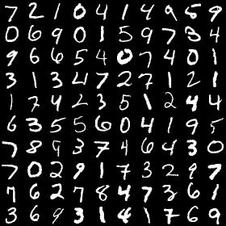
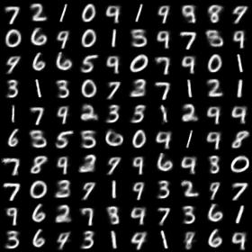
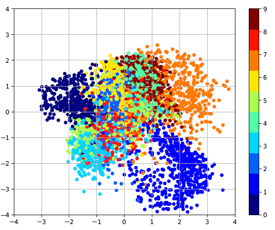
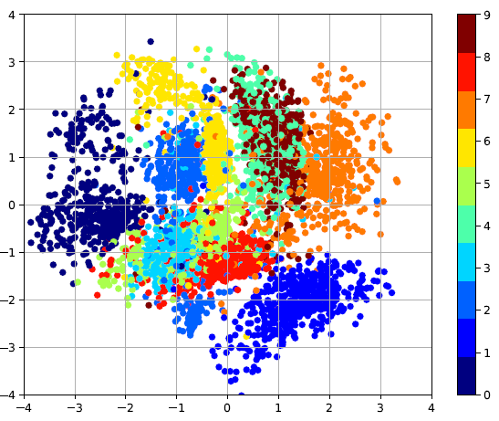
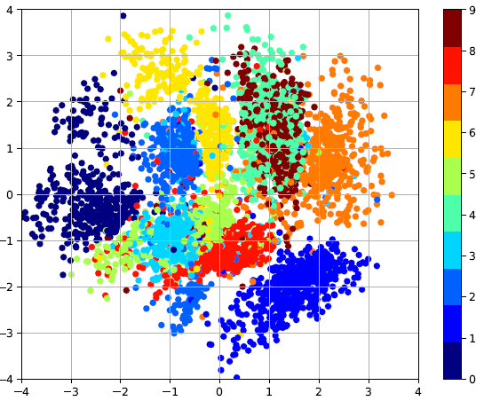

# Variational Auto-Encoder for MNIST

This is an implementation of variational auto-encoder(VAE) for MNIST using Vote-MI

## Usage
Recommend to use Python==3.8.18

```
conda create --name <env>
pip install -r requirements.txt
```

### The requirements should at least include...
```
tensorflow >= 2.0
numpy
argparse
matplotlib
cv2
```

### Command
```
python main.py --[argument] <value>
```

*Example* : `python main.py --dim_z 4`

### Arguments

* `--dim_z` : Dimension of latent vector. *Default* : `4`
* `--output` : File path of output images. *Default* : `results`
* `--dataset` : The name of Dataset. List : ['mnist', 'fashion-mnist']. *Default* : `mnist`
* `--seed` : Random Seed. *Default* : `0`
* `--add_noise` : Boolean for adding noise to input image(gaussian noise). *Default* : `False`
* `--noise_factor` : Factor of gaussian noise. *Default* : `0.7`
* `--n_hidden` : The number of hidden units in MLP. *Default* : `500`
* `--learning_rate` : Learning rate of adam optimizer. *Default* : `1e-3`
* `--num_epochs` : The number of epochs to run. *Default* : `40`
* `--batch_size` : Batch size. *Default* : `64`

* `--PMLR_z_range` : Rnage for uniformly distributed latent. *Default* : `2.0`
* `--PMLR_n_samples` : Number of samples in order to get distribution of labeled data. *Default* : `5000`
* `--model_dir` : Directory to save the trained model. *Default* : `model`

## Results

### VAE Training

Well trained VAE must be able to reproduce input images.

Images below show the performance of learned generative models for dimensionality dim_z=2.

Command : `python main.py --dim_z 2 --num_epochs 100`

|Input image|Reconstructed image from 2-D latent space|
|:---:|:---:|
|||

|2-D latent space (epoch 1)|2-D latent space (epoch 40)|2-D latent space (epoch 100)|
|:---:|:---:|:---:|
||||

### After finishing the VAE training

You will have the following files under the folder of `results` and `model`:

In `results`
*


### Learned MNIST manifold

VAE can learn data manifold via generative models with 2-dim.

If dimension of z is 2, images for visualization of learned data manifold should be generated.

Command : `python main.py --dim_z 2 --num_epochs 60`

|Learned MNIST manifold|Distribution of labeled data|
|:---:|:---:|
|||

## Reference
